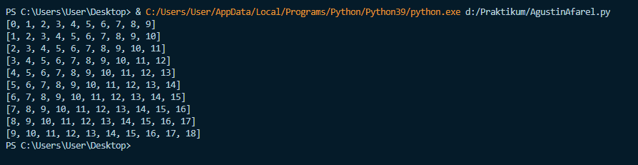

# Praktikum-Pertemuan-7
Dibuat untuk memenuhi tugas Bahasa Pemrograman

NAMA   :AGUSTIN AFAREL

NIM    :312010081

KELAS  :TI.20.B.1.

MATKUL :BAHASA PEMROGRAMAN

# LATIAN 1 

* Membuat program dengan perulangan bertingkat nested for yang menghasilkan output sebagai berikut:

 ```python
 print(list(range(0, 10, 1)))
print(list(range(1, 11, 1)))
print(list(range(2, 12, 1)))
print(list(range(3, 13, 1)))
print(list(range(4, 14, 1)))
print(list(range(5, 15, 1)))
print(list(range(6, 16, 1)))
print(list(range(7, 17, 1)))
print(list(range(8, 18, 1)))
print(list(range(9, 19, 1)))
```


# LATIAN 2

* Menampilkan bilangan n yang lebih kecil dari 0.5
* Nilai n diisi pada saat runtime
* Menggunakan for

```python
n=int(input("Masukkan Nilai N : "))

import random

for x in list(range(1,n+1,1)):
    print(random.uniform(0,0.5))

print()
```